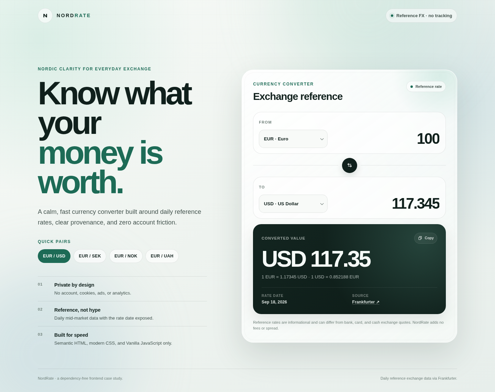
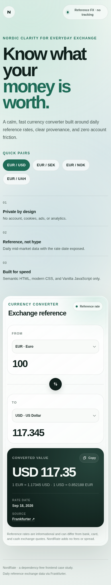

# NordRate — Nordic Currency Converter

**A dependency-free currency converter rebuilt from a small Vanilla JavaScript exercise into a polished frontend engineering case study.**

[**Open the live app →**](https://mykoladotsenko.github.io/NordRate/) · [Architecture](./ARCHITECTURE.md) · [Browser tests](./e2e/converter.spec.js)

NordRate focuses on one job: **convert an amount quickly and make the reference rate easy to trust and understand**.

## Product capabilities

- bidirectional conversion — edit either amount
- current currency metadata loaded from the rate provider
- quick EUR/USD, EUR/SEK, EUR/NOK, and EUR/UAH pair shortcuts
- source/target swap with value preservation
- visible reference-rate date
- reciprocal-rate display
- copyable conversion summary when the Clipboard API is available
- decimal comma, decimal point, and common grouped-number input
- explicit loading, fresh-rate, saved-rate, same-currency, invalid-input, and failure states
- responsive desktop/mobile layout
- reduced-motion and forced-colors support
- zero ads, cookies, analytics, accounts, or tracking

## Mobile

The mobile layout is verified in the browser suite at a 390 × 844 viewport, including a no-horizontal-overflow assertion.

## Runtime stack

- semantic HTML5
- modern CSS
- Vanilla JavaScript
- native ES modules
- Fetch API
- AbortController
- Web Storage API
- Clipboard API
- Intl formatting APIs

There are **zero runtime dependencies**.

## Verification stack

Development and CI tooling is intentionally separate from the shipped product:

- Node.js built-in test runner
- Playwright
- axe-core for automated WCAG A/AA checks
- Lighthouse CI
- GitHub Actions
- Dependabot

The exact verification dependency graph is committed in package-lock.json.

## Data source

NordRate uses the versioned **Frankfurter v2** exchange-rate API.

The application requests:

~~~text
GET /v2/rate/{base}/{quote}
GET /v2/currencies
~~~

The UI exposes the rate date because the product presents reference rates rather than pretending to provide a live bank or card quote.

Banks, card networks, cash exchanges, and payment providers can apply their own spreads or fees. NordRate adds no fee or spread of its own.

## Architecture

~~~text
index.html + style.css
        |
        v
    script.js
 browser orchestration
     /         \
    v           v
rate-client   rate-cache
    \           /
     v         v
    exchange.js
   pure domain helpers
~~~

The responsibilities are deliberately small and explicit:

- src/exchange.js — parsing, conversion math, formatting, API-payload validation, currency normalization
- src/rate-client.js — HTTP boundary and Frankfurter contract
- src/rate-cache.js — versioned last-known-rate persistence
- script.js — DOM discovery, interaction state, cancellation, timeouts, rendering, clipboard behavior

The domain and infrastructure boundaries can be tested without a browser.

See [ARCHITECTURE.md](./ARCHITECTURE.md) for the detailed trade-offs.

## Reliability model

### Race-safe pair changes

Every new rate request aborts the obsolete request with AbortController.

The response is also checked against the currently selected pair before it can enter UI state, so a slow old request cannot overwrite a newer selection.

### Bounded loading

- rate lookup timeout: 8 seconds
- currency-metadata timeout: 4 seconds

The product does not remain indefinitely in a loading state when the network or upstream service stalls.

### Last-known-rate fallback

Successful pair rates are stored behind a small versioned cache adapter.

A cached entry contains:

- currency pair
- reference date
- rate
- local save timestamp

Entries older than seven days, malformed values, corrupted JSON, invalid dates, and implausible future timestamps are rejected.

On a later visit NordRate can:

1. render a recent saved rate immediately;
2. attempt a fresh request;
3. replace it with the fresh rate when available; or
4. clearly label the fallback as **Saved rate** if refresh fails.

### API boundary validation

A rate response reaches the UI only when:

- base currency matches the requested base;
- quote currency matches the requested quote;
- rate is positive and numeric;
- date has the expected ISO form.

Unexpected upstream data fails closed instead of silently entering application state.

## Accessibility

The product relies primarily on native browser controls and semantic HTML.

Implemented behavior includes:

- skip navigation
- one clear page heading
- labeled currency and amount controls
- persistent visible keyboard focus
- focused live feedback rather than announcing the entire result card
- alert semantics for network failures
- touch-friendly targets
- no color-only status meaning
- reduced-motion support
- forced-colors support
- no hover-only functionality

The browser suite runs automated axe analysis against:

- normal converted-result state
- invalid-input state
- network-error state

## Browser verification

Playwright runs the real application with deterministic exchange-rate fixtures across:

- Chromium
- Firefox
- WebKit
- mobile Chromium

The suite covers:

- initial EUR → USD conversion
- editing from either side
- swap behavior
- quick-pair selection
- same-currency conversion
- invalid and recoverable amount input
- upstream 503 without cache
- saved-rate fallback
- obsolete-request race protection
- mobile/desktop horizontal-overflow protection

Portfolio screenshots are generated from the same deterministic browser environment used by the verification suite.

## Lighthouse budgets

CI runs three desktop Lighthouse passes and fails the build below these thresholds:

| Category | Minimum |
| --- | ---: |
| Performance | 95 |
| Accessibility | 100 |
| Best Practices | 95 |
| SEO | 100 |

This gives the visual polish a measurable performance and accessibility budget instead of relying only on subjective review.

## Amount parsing

The input accepts common international forms such as:

~~~text
12.5
12,5
1 234,50
1,234.50
1.234,50
~~~

The amount itself is not sent to the exchange-rate service. Only the selected currency pair is needed for a rate request.

## Local development

The shipped product needs no package installation.

Serve the repository over HTTP because native ES modules are used:

~~~bash
python -m http.server 8000
~~~

Then open:

~~~text
http://localhost:8000
~~~

## Quality checks

Verification tooling requires Node.js 24+.

Install the locked development toolchain:

~~~bash
npm ci
~~~

Static + unit checks:

~~~bash
npm run check
~~~

Cross-browser + accessibility suite:

~~~bash
npx playwright install chromium firefox webkit
npm run test:e2e
~~~

Lighthouse budgets:

~~~bash
npm run test:lighthouse
~~~

## Project structure

~~~text
.
├── .github/
│   ├── dependabot.yml
│   └── workflows/
│       └── quality.yml
├── docs/
│   └── screenshots/
│       ├── nordrate-desktop.png
│       └── nordrate-mobile.png
├── e2e/
│   ├── helpers/
│   │   └── frankfurter.js
│   ├── accessibility.spec.js
│   ├── converter.spec.js
│   └── screenshots.spec.js
├── scripts/
│   └── check-project.mjs
├── src/
│   ├── exchange.js
│   ├── rate-cache.js
│   └── rate-client.js
├── tests/
│   ├── exchange.test.js
│   ├── rate-cache.test.js
│   └── rate-client.test.js
├── ARCHITECTURE.md
├── LICENSE
├── README.md
├── favicon.svg
├── index.html
├── lighthouserc.json
├── package-lock.json
├── package.json
├── playwright.config.js
├── robots.txt
├── script.js
├── sitemap.xml
├── social-preview.png
└── style.css
~~~

## Design principle

> Spend complexity only where it protects user value.

NordRate deliberately does **not** add React, a router, a state library, a component framework, a backend, or a runtime animation/charting package.

For a one-page reference converter, the browser platform is enough. The engineering signal comes from reliability, explicit boundaries, accessibility, verification, and proportionality — not dependency count.

## License

MIT © Mykola Dotsenko
